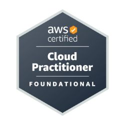

<h1>Hi there, I’m Aishwarya Ravichandran 👋</h1>
<h3>About Me</h3>

I am a Full-Stack Developer proficient in frontend technologies such as HTML, CSS, and JavaScript, and backend frameworks like Node.js, Spring Boot, and React. I have over six years of experience at Accenture where I gained valuable cybersecurity and quality assurance expertise, working on complex projects that ensured secure and efficient software solutions. Additionally, I am a certified AWS Cloud Practitioner, equipping me with the skills to leverage cloud technologies in building scalable and robust applications.

I am currently working as a graduate teaching assistant at Northeastern University. My Master’s coursework in Machine Learning and Natural Language Processing has sharpened my ability to work with cutting-edge technologies and develop data-driven solutions. I am passionate about leveraging these skills to drive transformative change, and I thrive on collaborating on innovative projects that push the boundaries of technology.

<ul>
  <li>View my <a href="resume.jpg">Resume</a></li>
</ul>

Feel free to explore my projects below and connect with me for opportunities to collaborate or discuss potential roles.

<ul>
<li>email: <a href="mailto:ravichandran.ai@northeastern.edu">ravichandran.ai@northeastern.edu</a></li>
<li>linkedin: https://www.linkedin.com/in/aishwaryaravi22/</li>
</ul>

<h3>Key Projects</h3>

<ul>
  <li><a href="https://github.com/aishwaryaravi2207/jingle.git">Music Application with Recommendation System:</a> Developed a dynamic music app using Ajax and implemented the music recommendation feature
using collaborative filtering</li>
  <li><a href="/">Sports Article Generation:</a> Developed a web application that generates sports articles using commentary data collected from
cricbuzz APIs and trained using LLMs</li>
  <li><a href="https://github.com/aishwaryaravi2207/houseQuest.git">House Quest Application:</a> Developed a house quest application to find the nearest housing option based on the selected
location using Dijkstra’s algorithm</li>
</ul>

<h2>Credentials</h2>

<!---
aishwaryaravi2207/aishwaryaravi2207 is a ✨ special ✨ repository because its `README.md` (this file) appears on your GitHub profile.
You can click the Preview link to take a look at your changes.
--->
